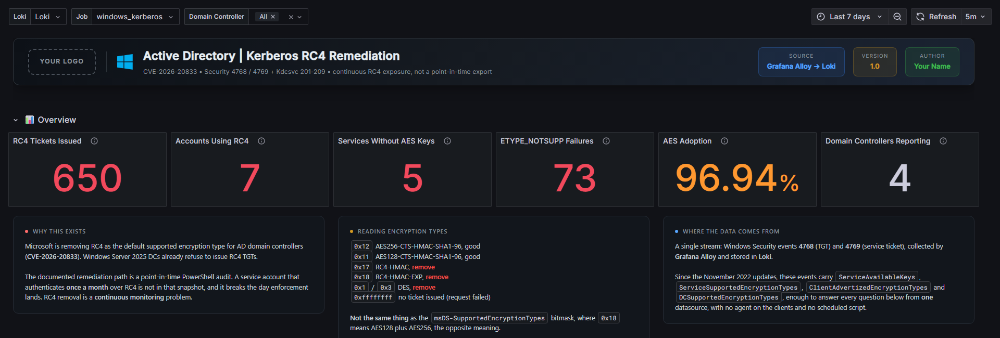
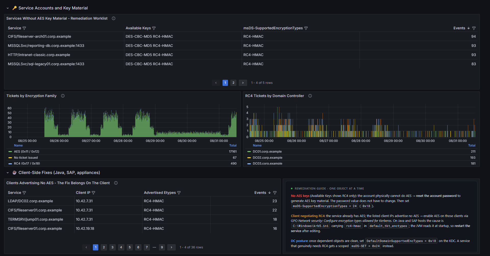
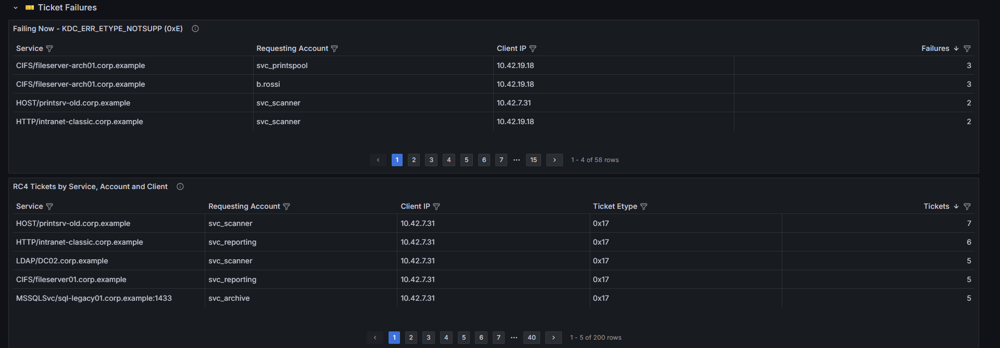
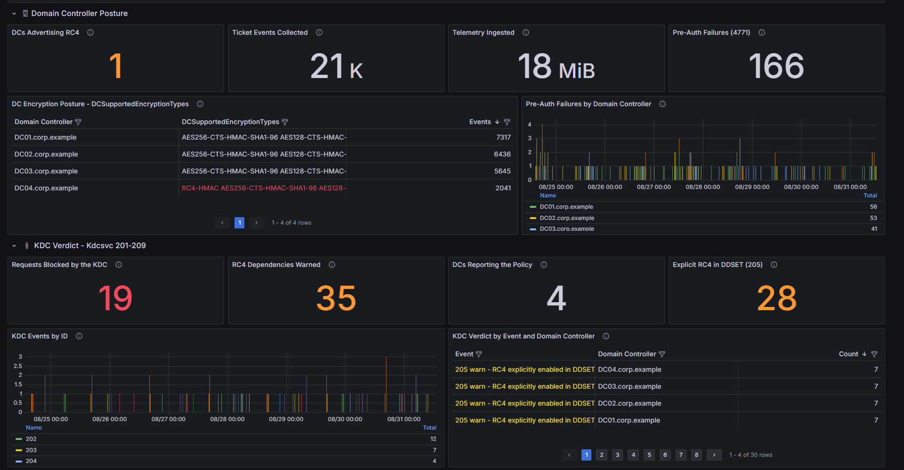

# Kerberos RC4 Remediation

Continuous tracking of RC4 usage in Active Directory, built from Windows event
logs collected by Grafana Alloy into Loki.

The documented way to prepare for the RC4 deprecation is to run a PowerShell
audit and read the table it prints. That table is a snapshot. Anything that
authenticates once a month, or once a quarter, or only when a batch job runs, is
simply not in it, and those are exactly the accounts that break on the day RC4
stops working.

This rebuilds the same question as a time series. Remediation stops being an
argument about a spreadsheet and becomes a number you watch go to zero.



The numbers in every screenshot here are simulated. The domain is
`corp.example` and the accounts are invented, because the point of the
dashboard is that it shows you real account names and those are nobody else's
business.

## What it answers

- Who is still receiving RC4 tickets, and on which domain controllers
- Which service accounts hold **no AES key material at all**, meaning they
  cannot do AES even if the client asks for it. These need a password reset.
- Which clients hold AES but **advertise only RC4**, which is a different fix
  entirely and a different worklist
- Which ticket requests already fail with `KDC_ERR_ETYPE_NOTSUPP`, meaning
  something is already broken today
- Which domain controllers still advertise RC4 in `msDS-SupportedEncryptionTypes`
- What the KDC itself is warning about or already refusing, from its own audit
  events

Relevant to the RC4 deprecation tracked as CVE-2026-20833.

## What it needs

| | |
|---|---|
| Collector | Grafana Alloy 1.14 or later, on each domain controller |
| Storage | Loki, self-hosted or Grafana Cloud |
| Windows | Server 2019, 2022 or 2025 domain controllers |
| Grafana | 11.0 or later |
| Events | Security 4768, 4769, 4771. System 201 to 209 from the KDC. |

Only domain controllers need the collector. There is nothing to install on
clients, no scheduled script, and no CSV anywhere.

## Setting it up

1. **Turn the events on.** Kerberos ticket auditing is on by default on a DC,
   but confirm it, and read [windows/kdc-events.md](windows/kdc-events.md) for
   the KDC's own events 201 to 209. Those are not an audit policy and there is
   no channel to enable, which surprises most people.
2. **Deploy the collector.** [`alloy/kerberos-rc4.alloy`](alloy/kerberos-rc4.alloy)
   is a standalone Alloy config. For a fleet, use
   [`alloy/fleet-pipeline.alloy`](alloy/fleet-pipeline.alloy) instead and push it
   through Grafana Fleet Management.
3. **Import the dashboard.** `dashboard.json`, then pick your Loki datasource.
   See [../../docs/importing.md](../../docs/importing.md) if panels come up
   empty.
4. **Wait.** The default window is seven days, because a monthly batch account
   will not show up in the last hour, and finding those is the entire point.

## Reading the results



The two worklists are deliberately separate, because the remediation is
different and mixing them wastes a lot of people's time:

**No AES key material.** The account's password predates the AES upgrade, or the
account is configured to refuse AES. The fix is a password reset, which
regenerates the AES keys. There is no way around it.

**AES available, RC4 advertised.** The account can do AES; the client is asking
for RC4. The fix is on the client or in the service configuration, not on the
account.

There is one filter in the queries worth knowing about. Events where
`ServiceAvailableKeys` is not applicable carry a literal `-`, which passes "not
empty", "not N/A" and "contains no AES". Without excluding it explicitly,
`krbtgt` and friends appear on the password-reset worklist. Those are false
positives, and the kind that gets somebody to reset twelve service accounts for
nothing.

### What is already broken



`KDC_ERR_ETYPE_NOTSUPP` means the KDC has already refused. These are not future
problems, they are today's, and they are usually invisible because the
application falls back to NTLM and nobody notices until the fallback is closed
too.

### The domain controllers, and the KDC's own opinion



The bottom half is the part most write-ups skip. `DCSupportedEncryptionTypes`
tells you which of your own domain controllers still advertise RC4, and events
201 to 209 are the KDC telling you, in its own words, what it is about to
refuse. If that row says `not reporting`, see
[windows/kdc-events.md](windows/kdc-events.md): those events only exist once the
disablement phase is active, and their absence is not an all-clear.

## Rebuilding the dashboard

```bash
python3 build.py                 # -> dashboard.json
python3 build.py --grafana-com   # -> dashboard.grafana-com.json
```

`build.py` is the source of truth. See
[../../docs/conventions.md](../../docs/conventions.md).

## Design notes

**Account names are never labels.** Accounts, service principal names, IP
addresses and encryption types are all parsed at query time from `event_data`.
Promoting any of them to a Loki label multiplies the stream count by the size of
your directory. Query time is slower; the bill is not.

**The Security stream drops the rendered message.** `exclude_event_message` is
on for 4768/4769/4771, because every field the dashboard reads lives in
`event_data` and the message is a redundant restatement of it. That is roughly
half the bytes on the wire for no loss of information, which matters when the
Security channel on a busy DC is measured in gigabytes a day.

The KDC events keep their message, because for those the message *is* the
payload: it names the account and the service. They are also rare, so the bytes
are free.

**No data is not an all-clear.** Every stat panel distinguishes "zero RC4
tickets" from "nothing is reporting". A green tile that means your collector
died is worse than no dashboard.

## Write-up

The reasoning, the failure modes and the five Fleet Management gotchas are in
[Kerberos hardening: measure RC4 before you turn it off](https://igorfasano.tech/blog/kerberos-rc4-hardening-with-grafana-alloy/).
